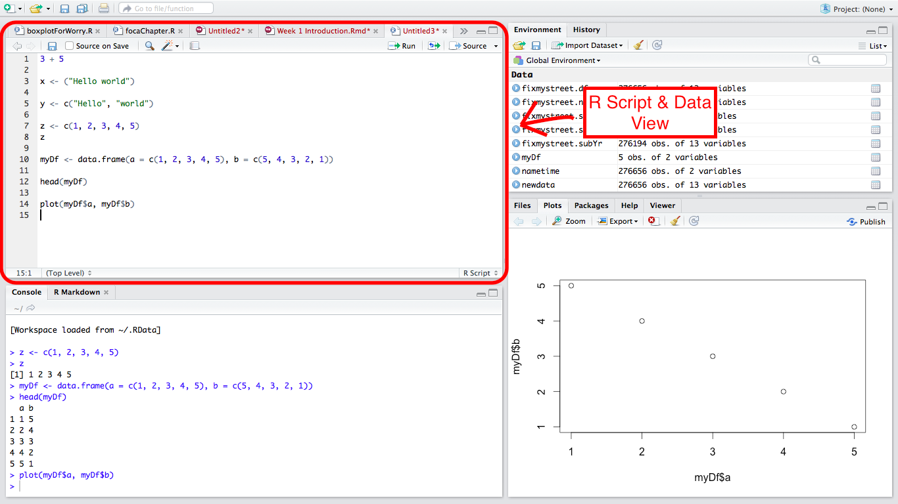
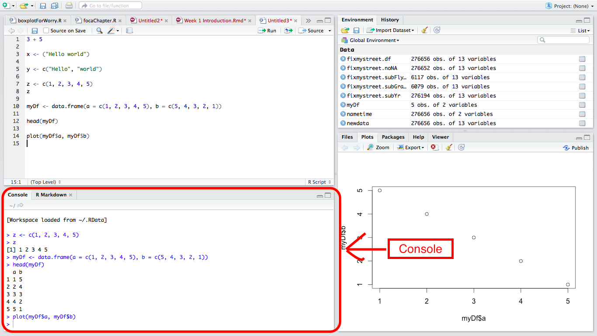
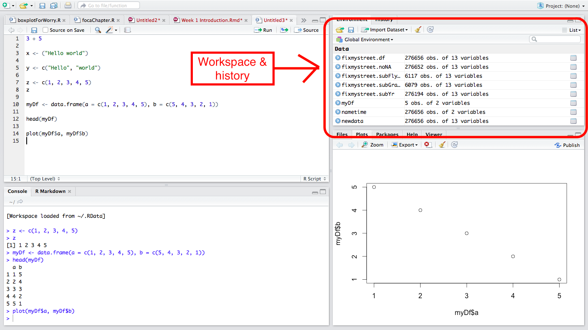
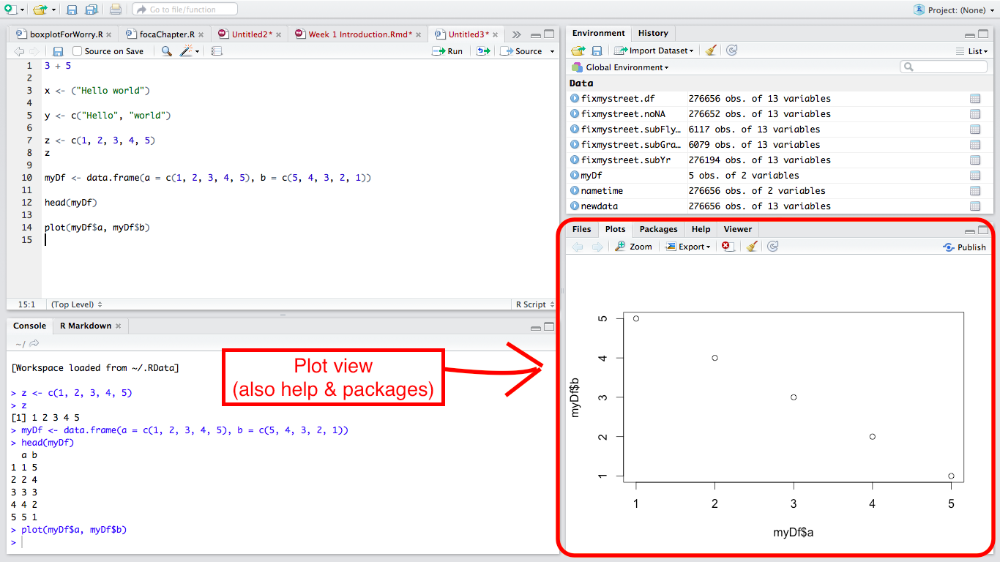

#Intro day R prep tasks

##Install R & R Studio
If you have not already, then please download and install R and R Studio onto your machines. You should be using your own laptops for this course, because that way you get used to working in an environment which you will continue to use after this Masters. However, sessions will be held in computer clusters in case you do not have access to a laptop (or something goes wrong...).

- click [here](https://www.youtube.com/watch?v=eD07NznguA4) for instructions using Windows or
- [here](https://www.youtube.com/watch?v=cX532N_XLIs&list=PLqzoL9-eJTNDw71zWePXyHx3_cm_fMP8S) for instructions using a Mac. 

##Open up R Studio

When you open R studio, you see there are 4 windows

###The r script and data view 

This window is where you write your code and where you can view your data



For example, to create a dataframe with two columns, one called "a" and one called "b", copy and paste the following code into an R script in your R Script and Data View window. (At this point dont worry about syntax etc)

```{r}
myDf <- data.frame(a = c(1, 2, 3, 4, 5), b = c(5, 4, 3, 2, 1))
```

Then highlight this bit of code you just copy and pasted with your mouse, and click on "Run" on the top right hand corner of the r script and data view window.

You've just run your first bit of r code, which was to create this dataframe. Now if you want to view this, that also happens in the r script and data view window. To do this, copy paste and run the code below like you did with the previous. 

```{r, eval = FALSE}
View(myDf)
```

Now a window will appear showing you the dataframe which you created earlier. To toggle between windows here, use the tabs. 

###Console view

Below the r script and data view there is the console view. 



You might have noticed that anything you ***run*** from the r script window above appears here. Outputs might also appear here. For example, in the previous code, we specified that we want to 
`View` the dataframe called MyDf. However, if we just wrote MyDf in the r script view and ran that, the output would be visible in the console view. Try it!

```{r}
myDf
```

This is also where you will see any errors that have gone wrong with your code. 

For example, try running the below code

```{r, error=TRUE}
name
```

The above error should appear in your console view. This means that it cannot find an object called helloWorld. Probably because we did not create this object. To create this object we would have to assign some value to it using the `<-` notation. 

So if we wanted name to be my name, we'd write:

```{r}
name <- "Reka"
```

Now if we copypasta this, this time there should be no error, and the consolve view will instead display what the value of the name object is: 

```{r, error=TRUE}
name
```

Error messages in R are pretty good at telling you exactly what went wrong. Handy tip though: if in doubt, copy and paste your error into google. You'll fix it in under 1 minute. 

###Workspace view

This section shows you what is in your workspace. It can be handy to check on your objects for example. 



It should have in there for you myDf. Next to it, it should say `5 obs of 2 variables`. This means that you have 2 columns (variables) and 5 rows (where each row is an observation). You might also have name object in there. This is a handy guide to everything that you've created in your session. 

###Plot etc view

And finally on the bottom right you have your plot/ files/ packages/ help/ viewier view. 



The ones you will use most common are plots, help, and potentially packages. 

The most common use of this is when you plot something, your plot appears here. 
Try plotting the two columns of our dataframe against each other. (As you might be noticing the syntax will be pretty straight forward...)

```{r}
plot(myDf$a, myDf$b)
```

The above plot should appear in your plot view. Yay!

The other common use of this window is to display the help documentation. R is very helpful, in that if you don't know how to use a prticular function, or you just want to learn more about it, all the information is built-in and very easy to call. All you need to do is type `?` in front of the thing you want to know about. 

So for example, if we wanted to know more about the plot function, we would type:

```{r, eval = FALSE}
?plot()
```

The plot view will automatically switch tabs to the 'help' tab, and display all the information you need there. 

Finally you can click on the packages tab to see what packages are already in your environment, and you can add or detach packages using this tab. 
