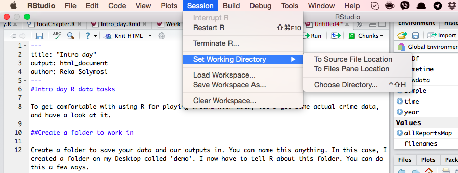
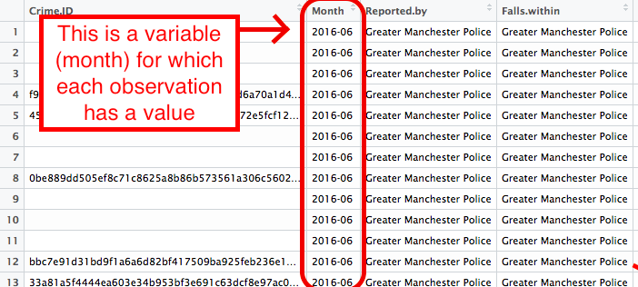
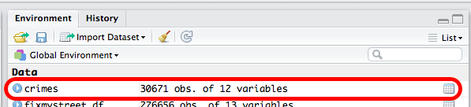

#Intro day R data tasks

To get comfortable with using R for playing around with data, let's get some actual crime data, and have a look at it.

##Create a folder to work in

Create a folder to save your data and our outputs in. In R, this is known as a **working directory**. You can name this anything. In this case, I created a folder called 'demo' inside the folder that has the course notes. I now have to tell R about this folder. You can do this a few ways. 

####One way is simple point and click: 

Click on Session > Set working directory > Choose directory...



Then navigate to the folder you want to use, open it, and click on 'Open'.

####Or the other way is to use code (you need to know the filepath for this):

The command to set working directory is `setwd()`. Inside the brackets you need to write the path to your folder, in quotation marks. So for me this is: 

```{r, eval=FALSE}
setwd("~/Desktop/R-for-Criminologists/demo")
```

Whichever way you choose, once you have done this you can save all data in this folder, and read them in from here. Also any outputs like plots and code get saved here as well.  

##Get some data

We can play around with police recorded crime data, which can be downloaded from the [police.uk](https://data.police.uk/data/) website. 

Let's stick local and download some data for crime in Manchester. 

To do this, open the [data.police.uk/data](https://data.police.uk/data/) website. 

- In `Date range` just select June 2016 - June 2016
- In `Force` find `Greater Manchester Police`, and tick the box next to it. 
- In `Data sets` tick `Include crime data`.
- Finally click on `Generate File` button.

This will take you to a download page, where you have to click the `Download now` button. This will open a dialogue to save a .zip file. Navigate to the working directory folder you've readet and save it there. Unzip the file. 

##Read the data into R

R reads in data in the form of dataframes. This is essentially the same as a spreadsheet. You have columnds that represent your **variables**. And rows that reporesent your **observations**

So for example, in this data set each row is one crime record.


And this column for example is the month variable. Each observation (crime) will have a value for this variable (the month that it was recorded).



So that is essentially a dataframe. So let's read in the downloaded and unzipped crime data into a dataframe. 

To do so, you need to create a dataframe object, that you map the data onto. So you need to give it a name, and then rrad the file into it. This name is what you will use to call the dataframe. Here I simply call it `crime`. 

To read in the .csv file, which is the format we just downloaded, the command is `read.csv`. 

Again there are two ways to read in the data, if you want to open a window where you can manually navigate and open the file, you can pass `file.choose()` argument to the read.csv() function. 

```{r, eval=FALSE}
crimes <- read.csv(file.choose())
```

Or, if you know the path to your file, you can hardcode it in there, within quotation marks:

```{r, eval=FALSE}
crimes <- read.csv("2016-06/2016-06-greater-manchester-street.csv")
```

```{r, echo=FALSE}
crimes <- read.csv("demo/2016-06/2016-06-greater-manchester-street.csv")
```

You might notice that `crimes` has appeared in your work environment window. It will tell you how many observations (rows - and incidentally the number of recorded crimes in June 2016 within the GMP jurisdiction) and how many variables (columns) your data has.



##Explore the data

As seen earlier, we can just have a look at our data using the `View()` function. 

```{r, eval=FALSE}
View(crimes)
```

###What are some variables in this data? 

What are the variables? 
What are some questions that you might ask that you could answer with this data?

####Some possibilities

#####Q1: How many crimes happened in June 2016 in the GMP jurisdiction?

A1: You can check this a few ways (eg: look in your environment, or the bottom of the data view) but I like explicitly asking R to tell me things, so I will ask it to count the **N**umber of **ROW**s with the `nrow()` function. 

```{r}
nrow(crimes)
```

There were a total of 30,671 crimes recorded in Greater Manchester in June 2016.

#####Q2: What types of crime were recorded?

A2: You can use the function `unique()` to get R to list all the unique character values any of your variables can take. 

```{r}
unique(crimes$Crime.type)
```

The types of crime recorded in this data set are: Anti-social behaviour, Violence and sexual offences, Other crime, Criminal damage and arson, Other theft, Vehicle crime, Burglary, Bicycle theft, Shoplifting, Drugs, Public order, Robbery, Theft from the person, Possession of weapons       
#####Q3: Which crime type had the most crimes recorded?

A3: To answer this question, you could make a frequency table using the `table()` command. A frequency table just counts the number of times that each crime type appears in the dataframe. Since each row is one crime, each time the crime type appears, one more instance of it can be counted. So a frequency table returns the frequency with which we see each crime type in our data.

Step 1: create table
```{r}
frequencyTableOfCrimeTypes <- table(crimes$Crime.type)
frequencyTableOfCrimeTypes
```

Since there are not too many crime types we can probably eyeball which crime type has the highest number of appearances in the data (frequency). However, I am lazy, so let's get R to tell me the answer instead, by sorting the table. 

You can use the `sort()` command to then arrange this table. You can set the parameter of `decreasing` to **T**rue or to **F**alse, depending on how you want to sort the data. 

Step 2: sort table
```{r}
sort(frequencyTableOfCrimeTypes, decreasing=T)
```

The most common crime recorded is anti-social behaviour.

#####Q4: What is the average number of crimes recorded per neighbourhood?

A4: One of the variables in the dataset is labelled `LSOA.name`. LSOA stands for Lower Level Super Output Area, and it is a geographical region that the Greater Manchester region (and all of the UK actually) is broken into. These areas are often used as proxys for identifying neighbourhoods. More on LSOAs can be found [here](http://webarchive.nationalarchives.gov.uk/20160105160709/http://www.ons.gov.uk/ons/guide-method/geography/beginner-s-guide/census/super-output-areas--soas-/index.html).

One interesting question would be to compare crimes between these neighbourhoods. Let's just look at total number of crimes in each neighbourhood. 

Above with Q3 we talked about how we can make a quick frequency table. This table tells us how many times each LSOA name appears in the data. As every row in the `crimes` dataframe is a crime incident, every time the LSOA name appears, it is a crime incident that happened in that neighbourhood. Therefore if we count the number of times each LSOA name appears in the list of crimes, we then find out how many crimes occurred there in June 2016. 

But of course we want R to count for us, so as before, to create a table, we use the `table()` funciton. Simples.

```{r}
crimesPerLsoa <- table(crimes$LSOA.name)
```

At this moment, this is a table. There is less scope for manipulation with tables than with dataframes in R, so let's turn it into a dataframe. You might be noticing that R commands are pretty much like telling the computer what you want it to do in English. So the command to turn something into a dataframe is `to.data.frame`. 

```{r}
crimesPerLsoaDf <- as.data.frame(crimesPerLsoa)
```

Let's have a look at this new dataframe. 

```{r, eval=FALSE}
View(crimesPerLsoaDf)
```

With viewing the dataframe, we also see that the column titles are `Var1` and `Freq`. This is because we created a **FREQ**uency table of the neighbourhood **VAR**iable. Basically variable here is neighbourhod, and frequency is the number of crimes that were recorded in each. If we want to, for clarity we can rename these. Don't worry too much about the syntax at this point.

```{r}
colnames(crimesPerLsoaDf)[colnames(crimesPerLsoaDf)=="Var1"] <- "neighbourhood"
colnames(crimesPerLsoaDf)[colnames(crimesPerLsoaDf)=="Freq"] <- "numCrimes"
```

***What are the variables in the new dataframe?***

***What are the observations (ie what does each row represent?)***

So one of the variables is the number of crimes, and each row is a neighbourhood. In order to get the average number of crimes in each neighbourhood we calculate the mean. Mean means average in statistics language. Same way you calculate the average, you can calculate the mean by adding up all the values, and then dividing by the total number of observations. 

```{r}
sum(crimesPerLsoaDf$numCrimes)/nrow(crimesPerLsoaDf)
```

But of course, we are lazy, and want to make the most of R's capabilities, so we can just use the ... `mean()` function!

```{r}
mean(crimesPerLsoaDf$numCrimes)
```

There are an average of 18 crimes per neighbourhood across Greater Manchester.

##HOMEWORK

In your groups come up with three more questions you could ask this data set and do your best to answer them. Use the provided R markdown template to create a PDF for submission. 