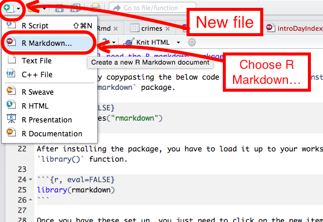
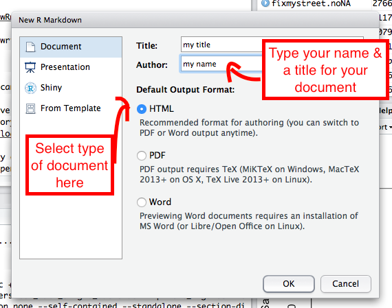

For your HW you will have to create an R markdown document. 

There are some tutorials on R markdown [here](http://rmarkdown.rstudio.com/lesson-1.html) and [here](http://www.jacolienvanrij.com/Tutorials/tutorialMarkdown.html). 

I'll just run thorugh the key steps it here. 

###First you'll need the R markdown package installed.

Achieve this by copypasting the below code where we call the `install.packages()` function, and pass it the `rmarkdown` package.

```{r, eval=FALSE}
install.packages("rmarkdown")
```

After installing the package, you have to load it up to your workspace. You do this with the `library()` function.

```{r, eval=FALSE}
library(rmarkdown)
```


###Opening a new R markdown file
Once you have these set up, you just need to click on the new item button on the top left corner of the screen, and select 'R Markdown...'



That will open a dialogue window where you can enter the doc title, your name, and choose what sort of doc it will be. Here let's build html documents. 



It opens up a file with some template/ example writing in there. 

###Homework template

For your homework I've created a template. You can find this on Blackboard. 

To load up the HW template, you have to save the template to your computer (ideally in the folder where you set your working directory ([see here](https://rawgit.com/maczokni/R-for-Criminologists/master/Intro_day_2.html))). 

Once you have saved the template, you open it by clicking on the open file icon, which opens a window where you can navigate to the file and open it. 


###Writing in your document. 

Writing in the document should be pretty straight forward, the homework template should specify where to write your question, answer, code, etc.

However you probably want to be able to make your documents look and feel the way you life them. So for that, the best and simplest resources are:

- the [R markdown cheatsheet](https://www.rstudio.com/wp-content/uploads/2016/03/rmarkdown-cheatsheet-2.0.pdf), and 
- the [R markdown reference](https://www.rstudio.com/wp-content/uploads/2015/03/rmarkdown-reference.pdf)

If you want some more info on these then I recommend going through some tutorials just Google 'R markdown tutorial' and you will find loads!

